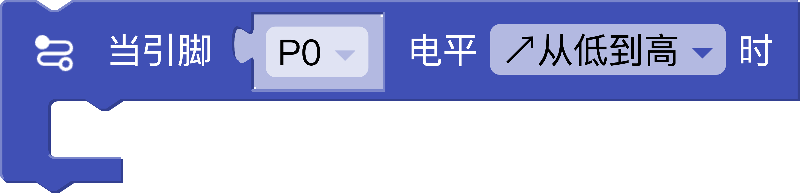

# 输入/输出

## 读取数字信号


**功能**:

- 读取指定引脚的数字电平状态(HIGH/LOW)
- 适用引脚:P0, P1, P2, P3, P6-P9, P13-P16, P19-P20

生成代码示例:

```python
from mpbit import MPin,PinMode

# 初始化数字输入引脚
p0 = MPin(0, PinMode.IN)

# 读取当前电平状态
p0.read_digital()
```

## 输出数字信号


**功能**:

- 设置指定引脚的输出电平
- 数字值 为 - 不设置 HIGH-高电平 LOW-低电平
- 适用引脚:P0, P1, P2, P3, P6-P9, P13-P16, P19-P20

生成代码示例：

```python
from mpbit import MPin,PinMode

# 初始化数字输出引脚
p0 = MPin(0, PinMode.OUT)

# 设置高电平输出
p0.write_digital(1)
```

## 读取模拟信号


**功能**:

- 读取指定引脚(ADC)的模拟值范围为0-4095
- 适用引脚:P0, P1, P2, P3

生成代码示例:

```python
from mpbit import MPin,PinMode

p0 = MPin(0, PinMode.ANALOG)

p0.read_analog()
```

## 设置模拟(PWM)信号


**功能**:

- 设置指定引脚(PWM)的模拟值范围为0-1023
- 适用引脚:P0,P1,P2,P3,P6,P7,P8,P9,P13,P14,P15,P16,P19,P20

生成代码示例:

```python
from mpbit import MPin,PinMode

p0 = MPin(0, PinMode.PWM)

p0.write_analog(1023)
```

## 读取引脚电平持续时间


**功能**:

- 获取引脚电平持续时间(微秒)
- 适用引脚:P0,P1,P2,P3,P6,P7,P8,P9,P13,P14,P15,P16,P19,P20

生成代码示例:

```python
from machine import time_pulse_us
# 高电平持续时间
time_pulse_us(Pin(Pin.P0),1,1000000)
```

## 当引脚电平上升下降或变化时



**功能**:

- 当引脚电平上升,下降或变化时(已加防抖算法处理)
- 可用于按钮传感器等按下,松开事件处理
- 适用引脚:P0,P1,P2,P3,P6,P7,P8,P9,P13,P14,P15,P16,P19,P20

生成代码示例:

```python
from mpbit import MPin,PinMode

def on_p0_rising(_):
    pass

p0 = MPin(0, PinMode.IN)

p0.irq(Pin.IRQ_RISING,on_p0_rising)
```

## 当引脚电平模拟值改变时


**功能**:

- 当引脚电平模拟值改变时,阈值40为防抖算法
- 可用于旋转电位传感器等的模拟值变化事件处理
- 适用引脚:P0,P1,P2,P3

生成代码示例:

```python
from mpbit import MPin,PinMode

def on_p0_analog_change(value):
    print(value)

p0 = MPin(0, PinMode.ANALOG)

p0.on_analog_change(on_p0_analog_change,threshold=40)
``` 