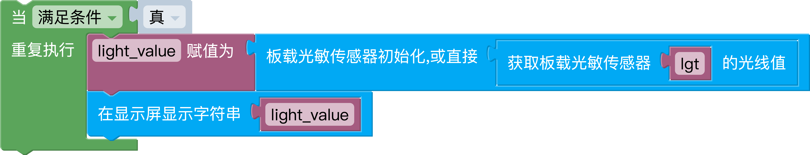

# 信息科技八年级-第一单元-第3课-拓展与提升
<br>



生成代码:

```python
    from educore import light,oled

    while True:
        light_value = light().read()
        oled.print(light_value)
```

<a href="./mix/u1l3_拓展与提升.mix" download>点击下载-u1l3_拓展与提升.mix</a>
