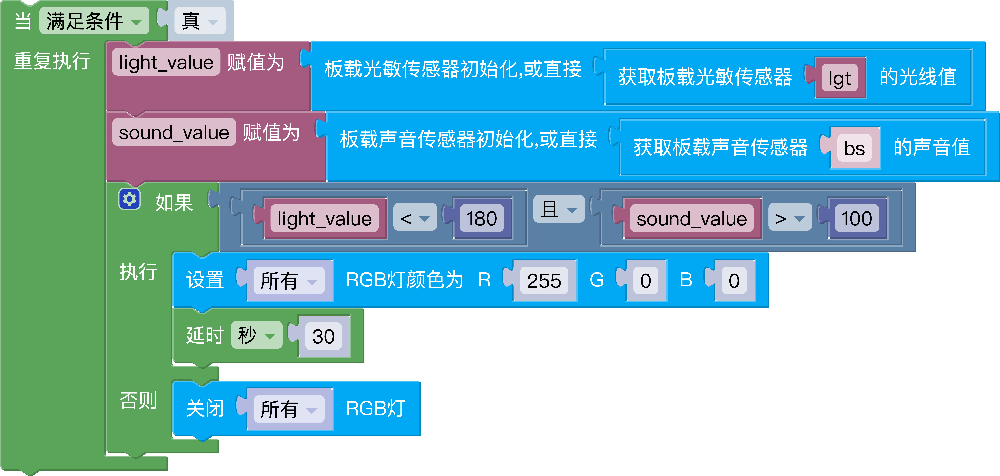

# 信息科技八年级-第一单元-第4课-物物相连有价值
<br>


生成代码:

```python
from educore import light,rgb,sound
import time

pxs = rgb()

while True:
    light_value = light().read()
    sound_value = sound().read()
    if light_value < 180 and sound_value > 100:
        pxs.write(index=[0,1,2],r=int(255),g=int(0),b=int(0))
        time.sleep(30)
    else:
        pxs.clear()
```

<a href="./mix/u1l4_拓展与提升.mix" download>点击下载-u1l4_拓展与提升.mix</a>
