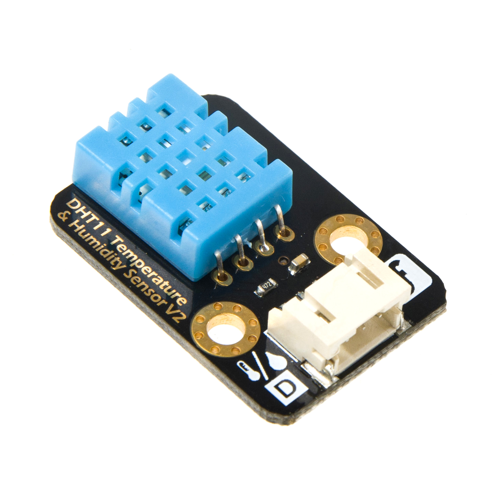
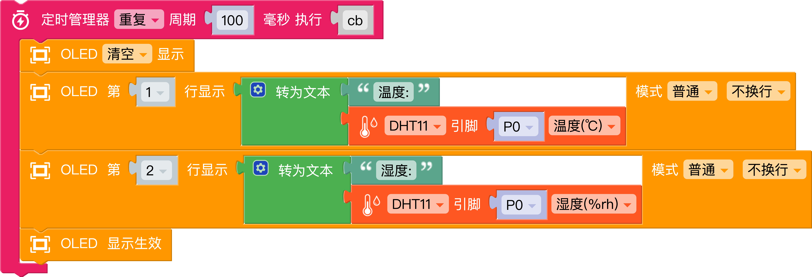

# DHT11数字温湿度传感器



**功能**

含有已校准数字信号输出的温湿度复合传感器

## 产品参数  
- 接口: 数字
- 电压: +5V
- 温度: 0-50℃ 误差±2℃
- 湿度：20-90%RH 误差±5%RH



## 生成代码示例  
```python
from timer_manager import TimerManager
from mpbit import oled
from mpbit.mpin import MPin
import dhtx

def cb():
    oled.fill(0)
    oled.draw_text(str('温度:'+str(dht11_p0.temperature())),0,0,mode=1,wrap=False)
    oled.draw_text(str('湿度:'+str(dht11_p0.humidity())),0,16,mode=1,wrap=False)
    oled.show()

dht11_p0 = dhtx.DHT11(MPin.P0)

TimerManager.loop(100,cb)
```

<a href="./mix/DHT11.mix" download>点击下载-DHT11.mix</a>