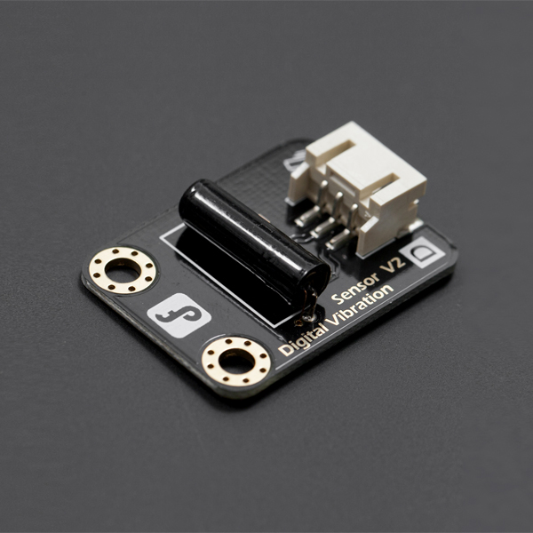

# 数字震动传感器



**功能**  
数字震动传感器是一种能够检测物体震动或倾斜的传感器。当传感器检测到震动时，会输出数字信号。

[DFRobot-数字震动传感器产品文档](https://wiki.dfrobot.com.cn/_SKU_DFR0027_%E6%95%B0%E5%AD%97%E9%9C%87%E5%8A%A8%E4%BC%A0%E6%84%9F%E5%99%A8)


生成代码

```python
from mpbit import MPin,PinMode

def on_p0_falling(_):
    print('震动')

p0 = MPin(0, PinMode.IN)

p0.irq(Pin.IRQ_FALLING,on_p0_falling)
```