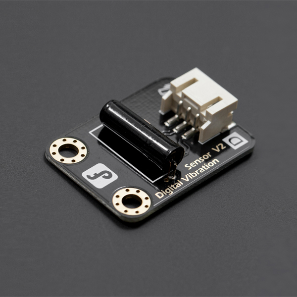

# 数字震动传感器



##### MicroPython示例
```python
from mpbit import MPin,PinMode
import time

def on_p0_falling(_):
    print('震动')
    time.sleep(0.5)

p0 = MPin(0, PinMode.IN)

p0.irq(Pin.IRQ_FALLING,on_p0_falling)

```