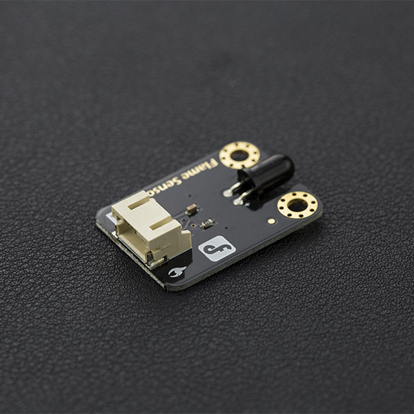
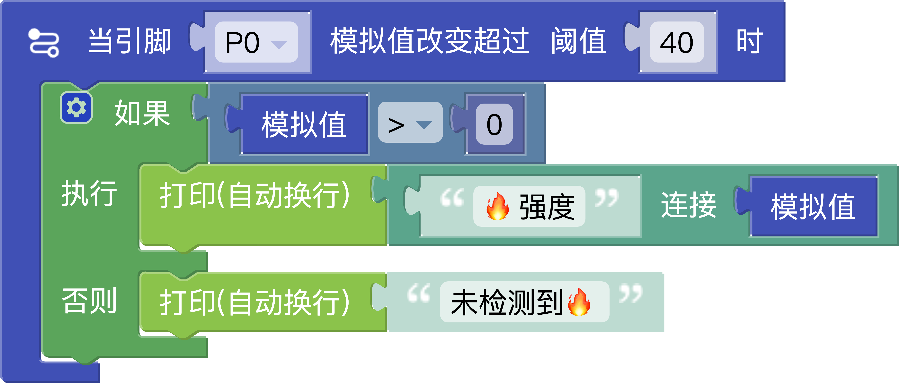

# 火焰传感器




**功能**

火焰传感器可以用来探测火源或其它波长在760纳米～1100纳米范围内的光源。

**产品参数**
- 接口: 模拟信号
- 电源 3.3V ~ 5V
- 探测距离:20cm (4.8V) ~ 100cm(1V)
  随火焰靠近或亮度增加,传感器输出电压增高
- 探测光谱带: 760nm-1100nm
- 反馈时间: 15us




## 生成代码

```python
from mpbit import MPin,PinMode

def on_p0_analog_change(value):
    if value > 0:
        print(('🔥强度' + value))
    else:
        print('未检测到🔥')

p0 = MPin(0, PinMode.ANALOG)

p0.on_analog_change(on_p0_analog_change,threshold=40)
```

<a href="./mix/火焰传感器.mix" download>点击下载-火焰传感器.mix</a>