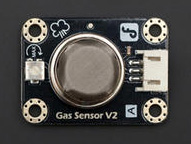

# 模拟烟雾报警器



**功能**

**产品参数**
- 接口: 模拟信号
- 电源: 5V
- 调节电位器: 顺时针调节大，逆时针调节小

[数据手册](https://img.dfrobot.com.cn/wikicn/62b2fb5caa613609f271523c/141f3be4a968057149dd76659026b4b0.pdf)


## 生成代码

```python
from mpbit import MPin,PinMode

def on_p0_analog_change(value):
    if value > 0:
        print(('烟雾强度' + value))
    else:
        print('未检测到烟雾')

p0 = MPin(0, PinMode.ANALOG)

p0.on_analog_change(on_p0_analog_change,threshold=40)
```

