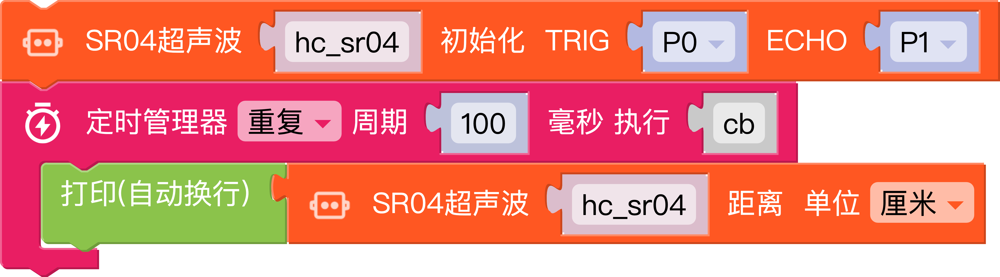

# SR04超声波传感器

**功能**

SR04超声波测距模块可提供2cm-400cm的距离感测，测距精度可达3mm。

## Mixly 图形化编程



::: tip
VCC引脚接3.3V
:::

## 生成代码

```python
from mpbit.mpin import MPin
from hcsr04 import HCSR04
from timer_manager import TimerManager
import time

def cb():
    print(hc_sr04.distance_cm())
    time.sleep(0.1)

hc_sr04 = HCSR04(trigger_pin=MPin.P0,echo_pin=MPin.P1)

TimerManager.loop(100,cb)
```