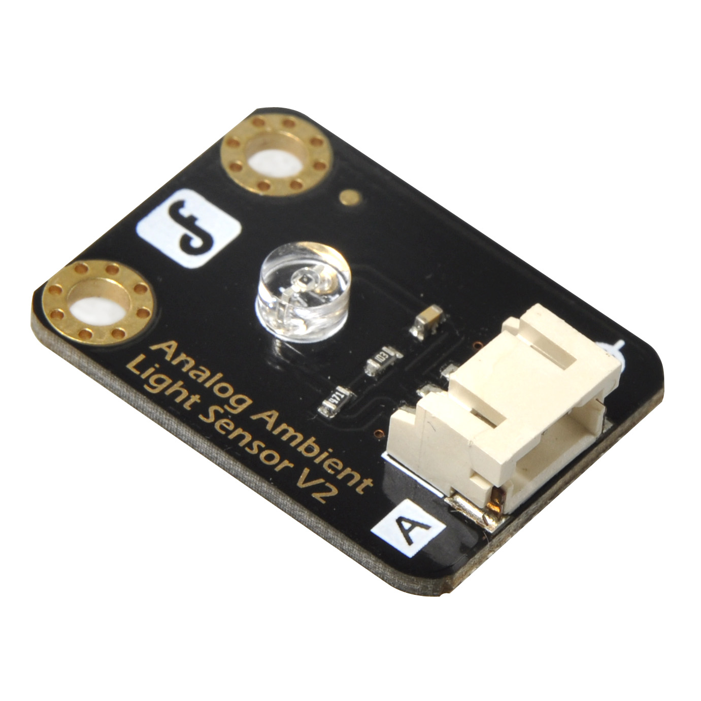

# 光线传感器



光线传感器是一种能够检测环境光线强度的传感器。它通常由光敏电阻或光电二极管构成，可以将光信号转换为电信号。


- MicroPython标准库范例

``` python
from machine import ADC
import time

adc0 = ADC(0)

while True:
    print("adc0=", adc0.read())
    time.sleep(0.1)
```

- LGBIT-Mixly高级用法
<br>


``` python

from mpbit import MPin,PinMode

def on_p0_analog_change(value):
    print(value)

p0 = MPin(0, PinMode.ANALOG)

p0.on_analog_change(on_p0_analog_change,threshold=40)
```

