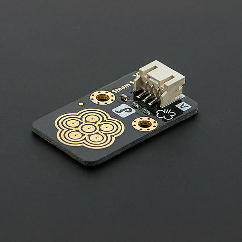

# 水分传感器



**功能**  
通过湿度触控传感器检测水分


## 生成代码示例

```python
from mpbit import MPin,PinMode

def on_p0_analog_change(value):
    print(value)

p0 = MPin(0, PinMode.ANALOG)

p0.on_analog_change(on_p0_analog_change,threshold=40)
```
